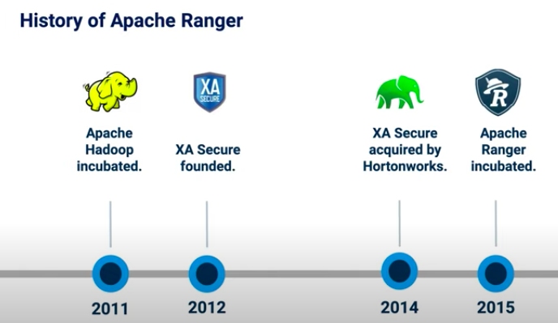

# Apache Ranger

##  ABout 
### Is Framework to enable monitoring and data access control in Big Data hadoop

## History of apache ranger



## Ranger architecture 


## Working 

### ranger uses plugin architecture to manager authorization and access control for data security in various hadoop component.

### Example with Hive


## here is the list of Ranger supported plugins 


# INstalling Ranger using Ambari 

## install and configure your database server out of  mysql/postgre/oracle/mariadb etc.

### I am using mariadb server

## Installing and configuration of mariadb server for ranger 

```
yum install mariadb-server

systemctl enable --now mariadb

```

## setup database root password 

```
mysql_secure_installation
```

## loging to db

```
[root@master1 ~]# mysql -u root -p
Enter password: 
Welcome to the MariaDB monitor.  Commands end with ; or \g.
Your MariaDB connection id is 4
Server version: 5.5.65-MariaDB MariaDB Server

Copyright (c) 2000, 2018, Oracle, MariaDB Corporation Ab and others.

Type 'help;' or '\h' for help. Type '\c' to clear the current input statement.

MariaDB [(none)]> 

```

## create user and give permission to  ranger user

```
CREATE USER 'rangerdba'@'localhost' IDENTIFIED BY 'rangerdba';

GRANT ALL PRIVILEGES ON *.* TO 'rangerdba'@'localhost';

CREATE USER 'rangerdba'@'%' IDENTIFIED BY 'rangerdba';

GRANT ALL PRIVILEGES ON *.* TO 'rangerdba'@'%';

GRANT ALL PRIVILEGES ON *.* TO 'rangerdba'@'localhost' WITH GRANT OPTION;

GRANT ALL PRIVILEGES ON *.* TO 'rangerdba'@'%' WITH GRANT OPTION;

FLUSH PRIVILEGES;

```

## test login 

```
[root@master1 ~]# mysql -u rangerdba -prangerdba
Welcome to the MariaDB monitor.  Commands end with ; or \g.
Your MariaDB connection id is 5
Server version: 5.5.65-MariaDB MariaDB Server

Copyright (c) 2000, 2018, Oracle, MariaDB Corporation Ab and others.

Type 'help;' or '\h' for help. Type '\c' to clear the current input statement.

MariaDB [(none)]> 

```

## install JDBC and setup ambari 

```
 yum install mysql-connector-java*
 
  ambari-server setup --jdbc-db=mysql --jdbc-driver=/usr/share/java/mysql-connector-java.jar
  
 ```
 
 ## OPen ambari dashboard
 
 ### add service 
 
 
 
 ### select ranger 
 
 
 
 ### confirm prerequiste 
 
 
 
 ###  choose node
 
 
 
 ##  Now follow the rest option 
 
 
 
